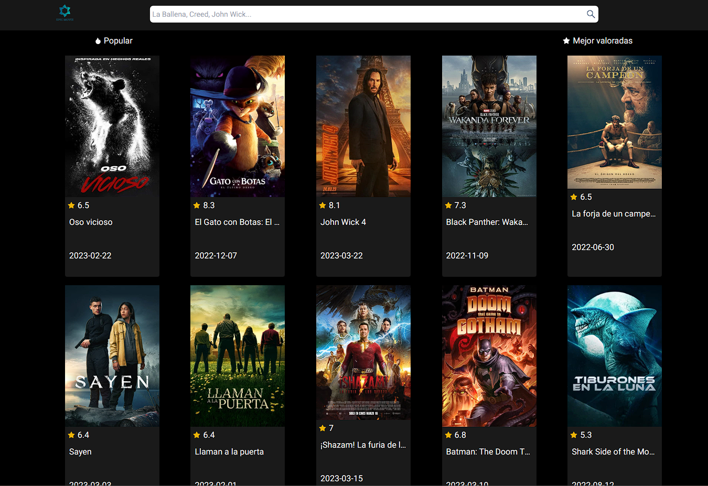
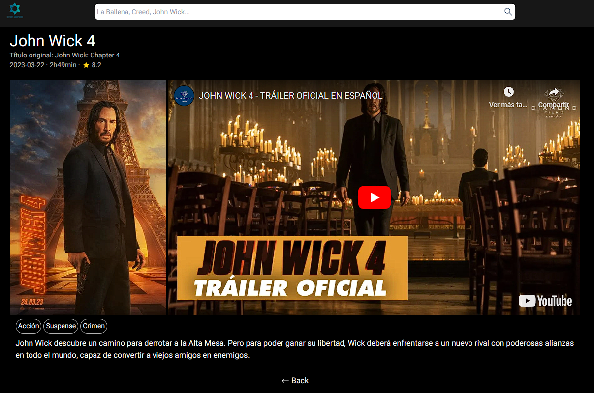

# Epic Movie

Proyecto de peliculas utilizando la API de [The Movie Data Base](https://www.themoviedb.org/)

## Overview

### Descripción de la página

La pagina cuenta con un home donde hay una pestaña de peliculas populares y otra con las peliculas mejor valoradas, tambien un buscador y detalles de cada pelicula junto con su trailer

### Screenshots

### Link to the page

- Site URL: [Epic_Movie](https://epic-movie.vercel.app/)

## My process

### Built with

- React
- React Router DOM
- React Icons
- React PLayer
- Tailwind CSS
- Flexbox
- CSS Grid
- Mobile-first workflow

## Author

- LinkedIn - [Andres Pulupa](https://www.linkedin.com/in/andres-pulupa/)